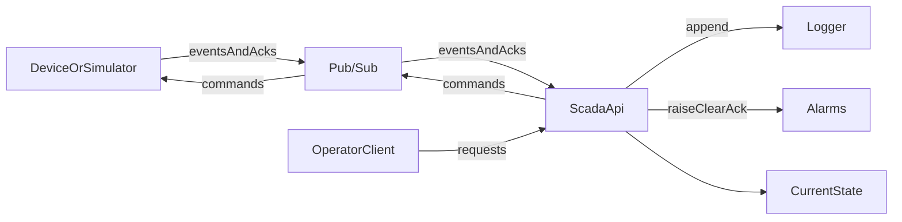
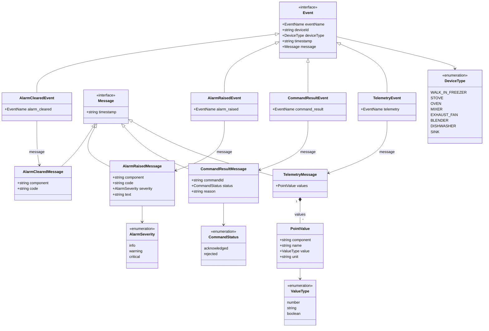
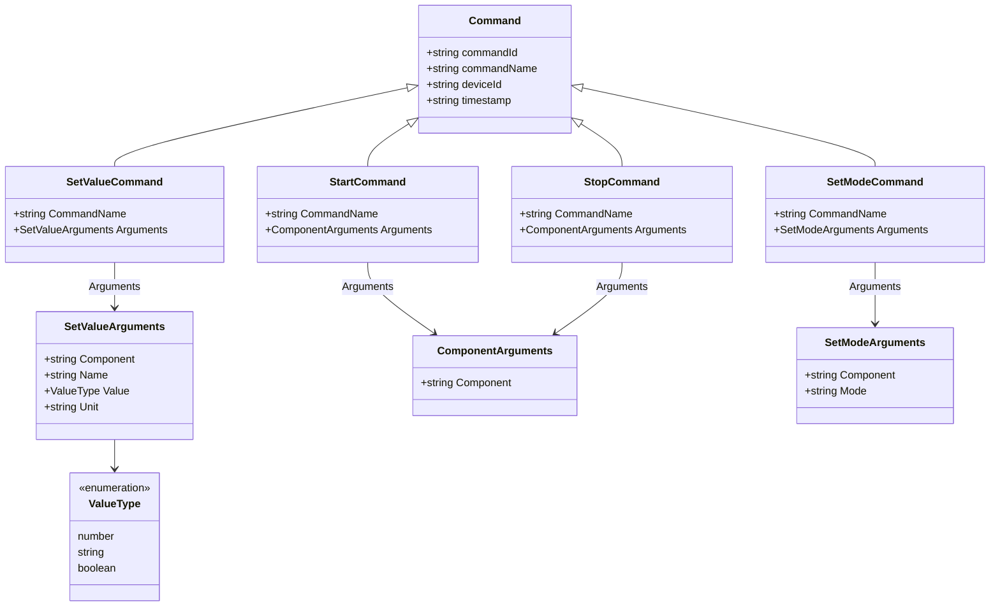

# KitchenOS SCADA design

KitchenOS SCADA supervises generic kitchen devices. A device reports points, accepts a small set of commands, and raises alarms. The equipment type lives on the device record. Event names and command names stay the same for every appliance.

This document describes the first slice: live state, commands with acknowledgement, alarms, and a short history. It specifies behavior and message contracts. It does not specify a language, library, or deployment tool.

## Purpose and scope

An operator can see what a device is doing now, send a command, see whether the device accepted it, and review recent messages and alarms.

This slice includes:

- Eight equipment profiles: walk-in freezer, stove, oven, mixer, exhaust fan, blender, dishwasher, and sink.
- Live point values, including power and cumulative energy on every profile except the sink.
- Commands `setValue`, `start`, `stop`, and `setMode`, with acknowledgement or timeout.
- An alarms table for the current alarm, and a Logger row for each alarm event.
- A short, queryable history of telemetry, commands, command results, and alarms.

Later work includes users and authentication, a graphical HMI, field protocols, long-term trending, and further device types (coolers, fryers, HVAC, gas, leak sensors, and the rest of a full kitchen). Those later types reuse the events in this document. Adding one means adding a profile, not an event name.

## Architecture

Devices and simulators publish and subscribe through Pub/Sub. The SCADA API is the only component that writes the Logger. Operators talk to the API through the operator interface.




| Actor               | Role                                                                                            |
| ------------------- | ----------------------------------------------------------------------------------------------- |
| Device or simulator | Publishes telemetry, command results, and alarm events. Subscribes for commands.                |
| SCADA API           | Subscribes to events, publishes commands, writes the Logger, and serves the operator interface. |
| Operator client     | Reads state, history, and alarms. Sends commands and acknowledgements.                          |
| Pub/Sub             | Live transport only. It does not keep history.                                                  |
| Logger              | Append-only record of telemetry, commands, command results, and alarms.                         |
| Alarms              | One row per alarm occurrence.                                                                   |


Pub/Sub topics are `kitchenos:events` and `kitchenos:commands`.

## Domain

**Device.** `id`, `name`, `deviceType`, online or offline, and the latest value of each point. `deviceType` selects the expected points, components, commands, and alarm codes. It never appears in `eventName` or `commandName`.

**Point.** A named reading on a device: `name`, `value`, optional `unit`, optional `component`, and the `timestamp` of the reading that set it. `value` is a number, string, or boolean. `component` names a sub-part such as a burner. Devices with a single zone omit it.

**Event.** Something a device publishes. `eventName`, `deviceId`, `deviceType`, `timestamp`, and a `message` body. `deviceType` is a field on the envelope. It is not part of `eventName` or `commandName`.

**Command.** Something the API asks a device to do. `commandId`, `commandName`, `deviceId`, `timestamp`, and `arguments`. State is `accepted`, `acknowledged`, `rejected`, or `timedOut`.

**Alarm.** One occurrence of a condition. It is raised, then optionally acknowledged, then cleared. Acknowledgement does not clear it. Active means `cleared_at` is null.

**History entry.** One row in the Logger.

Timestamps are ISO-8601 UTC strings. `timestamp` is when the device produced the event or when the API accepted the command. `recorded_at` is when the API wrote the log row.

## Closed vocabularies

`eventName`, `deviceType`, alarm `code`, telemetry point `name`, and `unit` are closed lists. Messages use the values in these lists. A new reading, alarm, or appliance means adding a value here.


| List        | Message field    |
| ----------- | ---------------- |
| Event name  | `eventName`      |
| Device type | `deviceType`     |
| Alarm code  | `code`           |
| Point name  | telemetry `name` |
| Unit        | `unit`           |


Event names: `telemetry`, `command_result`, `alarm_raised`, `alarm_cleared`.

Device types: `WALK_IN_FREEZER`, `STOVE`, `OVEN`, `MIXER`, `EXHAUST_FAN`, `BLENDER`, `DISHWASHER`, `SINK`.

Alarm codes: `over-temperature`, `under-temperature`, `door-open`, `fault`, `leak`, `filter`, `low-level`, `cycle-fault`.


| Point name    | Unit when present |
| ------------- | ----------------- |
| `temperature` | `C`               |
| `setpoint`    | `C`               |
| `humidity`    | `%`               |
| `door`        | none              |
| `valve`       | none              |
| `powerState`  | none              |
| `compressor`  | none              |
| `heating`     | none              |
| `motor`       | none              |
| `power`       | `W`               |
| `energy`      | `kWh`             |
| `speed`       | `rpm`             |
| `fanSpeed`    | `%`               |
| `airflow`     | `m3/h`            |
| `timer`       | `s`               |
| `mode`        | none              |
| `cycle`       | none              |
| `filter`      | none              |
| `waterLevel`  | `%`               |
| `detergent`   | `%`               |
| `flow`        | `L/min`           |
| `consumption` | `L`               |
| `leak`        | none              |


State words such as `open`, `closed`, `on`, and `off` are point values. They are not point names.

## Equipment profiles

Point names and units come from the closed lists above. Profiles list which of those values each device type reports.

### Shared points


| Name          | Value   | Unit or states                         |
| ------------- | ------- | -------------------------------------- |
| `temperature` | number  | `C`                                    |
| `setpoint`    | number  | `C`                                    |
| `humidity`    | number  | `%`                                    |
| `door`        | string  | `open`, `closed`                       |
| `valve`       | string  | `open`, `closed`                       |
| `powerState`  | string  | `on`, `off`                            |
| `compressor`  | string  | `on`, `off`                            |
| `heating`     | string  | `on`, `off`                            |
| `motor`       | string  | `on`, `off`                            |
| `power`       | number  | `W`                                    |
| `energy`      | number  | `kWh`                                  |
| `speed`       | number  | `rpm`                                  |
| `fanSpeed`    | number  | percent                                |
| `airflow`     | number  | `m3/h`                                 |
| `timer`       | number  | `s`                                    |
| `mode`        | string  | device-defined                         |
| `cycle`       | string  | `idle`, `running`, `complete`, `fault` |
| `filter`      | string  | `ok`, `dirty`                          |
| `waterLevel`  | number  | percent                                |
| `detergent`   | number  | percent                                |
| `flow`        | number  | `L/min`                                |
| `consumption` | number  | `L`                                    |
| `leak`        | boolean |                                        |


Energy is the points `power` and `energy`. It is not its own device type. Every mock device reports both except `SINK`.

A later profile that needs a new point, such as `pressure` or `voltage`, adds that point name and unit to the closed lists first.

### Shared alarm codes

Alarm codes are the closed list on `alarm_raised`. They are not event names.

`over-temperature`, `under-temperature`, `door-open`, `fault`, `leak`, `filter`, `low-level`, `cycle-fault`.

A code may be paired with `component`, so one burner can be in alarm while another is not.

### Profiles


| `deviceType`      | Components                                                     | Points                                                                  | Commands                                  | Alarm codes                                                   |
| ----------------- | -------------------------------------------------------------- | ----------------------------------------------------------------------- | ----------------------------------------- | ------------------------------------------------------------- |
| `WALK_IN_FREEZER` | none                                                           | `temperature`, `setpoint`, `compressor`, `door`, `power`, `energy`      | `setValue` on `setpoint`, `setMode`       | `over-temperature`, `under-temperature`, `door-open`, `fault` |
| `STOVE`           | `burner-1`, `burner-2`, further burners defined by that device | on each burner: `temperature`, `setpoint`, `heating`, `power`, `energy` | `setValue`, `start`, `stop`               | `over-temperature`, `fault`                                   |
| `OVEN`            | none                                                           | `temperature`, `setpoint`, `timer`, `door`, `mode`, `power`, `energy`   | `setValue` on `setpoint`, `start`, `stop` | `over-temperature`, `door-open`, `fault`                      |
| `MIXER`           | none                                                           | `motor`, `speed`, `power`, `energy`                                     | `setValue` on `speed`, `start`, `stop`    | `fault`                                                       |
| `EXHAUST_FAN`     | none                                                           | `fanSpeed`, `airflow`, `filter`, `powerState`, `power`, `energy`        | `setValue` on `fanSpeed`, `start`, `stop` | `filter`, `fault`                                             |
| `BLENDER`         | none                                                           | `motor`, `speed`, `power`, `energy`                                     | `setValue` on `speed`, `start`, `stop`    | `fault`                                                       |
| `DISHWASHER`      | none                                                           | `temperature`, `cycle`, `waterLevel`, `detergent`, `power`, `energy`    | `start`, `stop`                           | `fault`, `cycle-fault`, `low-level`                           |
| `SINK`            | none                                                           | `temperature`, `flow`, `consumption`, `leak`, `valve`                   | `setValue` on `valve`                     | `leak`                                                        |


Defrost is `setMode` with `mode` set to `defrost`. Burner count is a property of each stove instance. The event schema does not fix it. The mock stove has four burners. Full payloads for every mock device are in [Assumed device data](#assumed-device-data).

## Events and messages

### Event envelope

Every message on `kitchenos:events` uses one envelope. `message.timestamp` is the same instant as the envelope `timestamp`, so a log row can be read without the envelope.

```json
{
  "eventName": "telemetry",
  "deviceId": "STOVE",
  "deviceType": "STOVE",
  "timestamp": "2026-09-26T13:00:00Z",
  "message": {}
}
```


| Envelope field | Stored as                                          |
| -------------- | -------------------------------------------------- |
| `eventName`    | `message_type`, when the event is logged           |
| `deviceId`     | `device_id`                                        |
| `deviceType`   | not stored again; the device record already has it |
| `timestamp`    | copied into `message.timestamp`                    |
| `message`      | the message body                                   |


`kitchenos:events` carries `telemetry`, `command_result`, `alarm_raised`, and `alarm_cleared`.

`kitchenos:commands` carries commands. A command is not an event. The API creates `commandId` before publishing.

The Logger stores `device_id`, `message_type`, and `message`. It does not store the envelope a second time. Alarm events update the alarms table and are also appended to the Logger. `message_type` is `alarm_raised` or `alarm_cleared`, and `message` is the alarm message body.

### Class diagrams

`EventName` and `CommandName` are fixed on each concrete type. `Component`, `Unit`, and `Reason` are optional. `Value` is a number, string, or boolean.

#### Event types and messages

The event carries the envelope. The message carries the body. Each event type fixes `eventName` and points at one message type. Each message type adds only the fields past `timestamp`.




`component`, `unit`, and `reason` may be omitted. `TelemetryMessage.values` holds one or more points.

#### Commands

A command is not an event. `Start` and `Stop` share `ComponentArguments` because that optional component is their only argument.




`SetValueCommand.CommandName` is `setValue`. `StartCommand.CommandName` is `start`. `StopCommand.CommandName` is `stop`. `SetModeCommand.CommandName` is `setMode`. The API assigns `CommandId` before the command is published.

### `telemetry`

Logged. The latest value for each `deviceId` + `component` + `name` replaces the current point.

```json
{
  "timestamp": "2026-09-26T13:00:00Z",
  "values": [
    { "name": "temperature", "value": -18.0, "unit": "C" },
    { "component": "burner-1", "name": "temperature", "value": 190, "unit": "C" }
  ]
}
```

`unit` and `component` may be omitted.

### `command`

Logged with `message_type` `command`, and published on `kitchenos:commands`. The stored `message` is the object below, except `deviceId`, which is the `device_id` column.

`commandName` is only `setValue`, `start`, `stop`, or `setMode`.

```json
{
  "commandId": "b7e6c0e2-1f4a-4c0a-9a1e-6d0c2a9f0c11",
  "commandName": "setValue",
  "deviceId": "STOVE",
  "timestamp": "2026-09-26T13:00:01Z",
  "arguments": { "component": "burner-1", "name": "setpoint", "value": 180, "unit": "C" }
}
```


| Command    | Arguments                                              |
| ---------- | ------------------------------------------------------ |
| `setValue` | `name`, `value`, optional `component`, optional `unit` |
| `start`    | optional `component`                                   |
| `stop`     | optional `component`                                   |
| `setMode`  | `mode`, optional `component`                           |


### `command_result`

Logged. `status` is `acknowledged` or `rejected`. `reason` is a string or null.

```json
{
  "timestamp": "2026-09-26T13:00:02Z",
  "commandId": "b7e6c0e2-1f4a-4c0a-9a1e-6d0c2a9f0c11",
  "status": "acknowledged",
  "reason": null
}
```

### `alarm_raised`

Logged with `message_type` `alarm_raised`, and inserts an alarms row. `text` is stored in the alarm `message` column. `severity` is `info`, `warning`, or `critical`. `component` may be omitted.

```json
{
  "timestamp": "2026-09-26T13:00:03Z",
  "component": "burner-1",
  "code": "over-temperature",
  "severity": "critical",
  "text": "value crossed the configured limit"
}
```

If an active alarm already exists for the same `device_id`, `component`, and `code`, the API ignores the new raise and does not write another Logger row.

### `alarm_cleared`

Logged with `message_type` `alarm_cleared`. Sets `cleared_at` on the active row with the same `device_id`, `component`, and `code`. If none is active, the API ignores the clear and does not write a Logger row.

```json
{
  "timestamp": "2026-09-26T13:05:00Z",
  "component": "burner-1",
  "code": "over-temperature"
}
```

Operator acknowledgement is `POST /alarms/{id}/acknowledge`. It is not a device event and it does not append a Logger row.

### Duplicate delivery

Handling is at-least-once.

- A second `telemetry` row with the same `device_id` and `message.timestamp` is skipped.
- A `command` or `command_result` is applied once per `commandId`.
- A second `alarm_raised` for an active `device_id` + `component` + `code` does not insert another row.

## Assumed device data

As this is a mock project, no live kitchen is connected. The table below is the data every simulator, test, and class should use. Point names, units, components, and sample values are fixed.

Each device publishes on `kitchenos:events`. Each device subscribes to `kitchenos:commands` and answers with `command_result`. Commands shown here are the messages that device must accept.


| `deviceType` | Name | Components |
| --- | --- | --- |
| `WALK_IN_FREEZER` | Walk-in Freezer | none |
| `STOVE` | Line Stove | `burner-1`, `burner-2`, `burner-3`, `burner-4` |
| `OVEN` | Deck Oven | none |
| `MIXER` | Floor Mixer | none |
| `EXHAUST_FAN` | Hood Exhaust | none |
| `BLENDER` | Bar Blender | none |
| `DISHWASHER` | Dishwasher | none |
| `SINK` | Prep Sink | none |


### `WALK_IN_FREEZER`

Telemetry:

```json
{
  "eventName": "telemetry",
  "deviceId": "WALK_IN_FREEZER",
  "deviceType": "WALK_IN_FREEZER",
  "timestamp": "2026-09-26T13:00:00Z",
  "message": {
    "timestamp": "2026-09-26T13:00:00Z",
    "values": [
      { "name": "temperature", "value": -18.2, "unit": "C" },
      { "name": "setpoint", "value": -18.0, "unit": "C" },
      { "name": "compressor", "value": "on" },
      { "name": "door", "value": "closed" },
      { "name": "power", "value": 860, "unit": "W" },
      { "name": "energy", "value": 412.6, "unit": "kWh" }
    ]
  }
}
```

Commands it accepts:

```json
{
  "commandId": "c0ffee00-0001-4000-8000-000000000001",
  "commandName": "setValue",
  "deviceId": "WALK_IN_FREEZER",
  "timestamp": "2026-09-26T13:00:01Z",
  "arguments": { "name": "setpoint", "value": -20.0, "unit": "C" }
}
```

```json
{
  "commandId": "c0ffee00-0001-4000-8000-000000000002",
  "commandName": "setMode",
  "deviceId": "WALK_IN_FREEZER",
  "timestamp": "2026-09-26T13:10:00Z",
  "arguments": { "mode": "defrost" }
}
```

Command result:

```json
{
  "eventName": "command_result",
  "deviceId": "WALK_IN_FREEZER",
  "deviceType": "WALK_IN_FREEZER",
  "timestamp": "2026-09-26T13:00:02Z",
  "message": {
    "timestamp": "2026-09-26T13:00:02Z",
    "commandId": "c0ffee00-0001-4000-8000-000000000001",
    "status": "acknowledged",
    "reason": null
  }
}
```

Alarm:

```json
{
  "eventName": "alarm_raised",
  "deviceId": "WALK_IN_FREEZER",
  "deviceType": "WALK_IN_FREEZER",
  "timestamp": "2026-09-26T13:05:00Z",
  "message": {
    "timestamp": "2026-09-26T13:05:00Z",
    "code": "door-open",
    "severity": "warning",
    "text": "Walk-in freezer door is open"
  }
}
```

```json
{
  "eventName": "alarm_cleared",
  "deviceId": "WALK_IN_FREEZER",
  "deviceType": "WALK_IN_FREEZER",
  "timestamp": "2026-09-26T13:06:00Z",
  "message": {
    "timestamp": "2026-09-26T13:06:00Z",
    "code": "door-open"
  }
}
```

### `STOVE`

Four burners. Every burner reports the same point names. `component` tells them apart.

Telemetry:

```json
{
  "eventName": "telemetry",
  "deviceId": "STOVE",
  "deviceType": "STOVE",
  "timestamp": "2026-09-26T13:00:00Z",
  "message": {
    "timestamp": "2026-09-26T13:00:00Z",
    "values": [
      { "component": "burner-1", "name": "temperature", "value": 190, "unit": "C" },
      { "component": "burner-1", "name": "setpoint", "value": 190, "unit": "C" },
      { "component": "burner-1", "name": "heating", "value": "on" },
      { "component": "burner-1", "name": "power", "value": 2400, "unit": "W" },
      { "component": "burner-1", "name": "energy", "value": 18.4, "unit": "kWh" },
      { "component": "burner-2", "name": "temperature", "value": 22, "unit": "C" },
      { "component": "burner-2", "name": "setpoint", "value": 0, "unit": "C" },
      { "component": "burner-2", "name": "heating", "value": "off" },
      { "component": "burner-2", "name": "power", "value": 0, "unit": "W" },
      { "component": "burner-2", "name": "energy", "value": 4.1, "unit": "kWh" },
      { "component": "burner-3", "name": "temperature", "value": 160, "unit": "C" },
      { "component": "burner-3", "name": "setpoint", "value": 160, "unit": "C" },
      { "component": "burner-3", "name": "heating", "value": "on" },
      { "component": "burner-3", "name": "power", "value": 1800, "unit": "W" },
      { "component": "burner-3", "name": "energy", "value": 11.0, "unit": "kWh" },
      { "component": "burner-4", "name": "temperature", "value": 21, "unit": "C" },
      { "component": "burner-4", "name": "setpoint", "value": 0, "unit": "C" },
      { "component": "burner-4", "name": "heating", "value": "off" },
      { "component": "burner-4", "name": "power", "value": 0, "unit": "W" },
      { "component": "burner-4", "name": "energy", "value": 2.7, "unit": "kWh" }
    ]
  }
}
```

Commands it accepts:

```json
{
  "commandId": "c0ffee00-0002-4000-8000-000000000001",
  "commandName": "setValue",
  "deviceId": "STOVE",
  "timestamp": "2026-09-26T13:00:01Z",
  "arguments": { "component": "burner-2", "name": "setpoint", "value": 180, "unit": "C" }
}
```

```json
{
  "commandId": "c0ffee00-0002-4000-8000-000000000002",
  "commandName": "start",
  "deviceId": "STOVE",
  "timestamp": "2026-09-26T13:00:01Z",
  "arguments": { "component": "burner-2" }
}
```

```json
{
  "commandId": "c0ffee00-0002-4000-8000-000000000003",
  "commandName": "stop",
  "deviceId": "STOVE",
  "timestamp": "2026-09-26T13:20:00Z",
  "arguments": { "component": "burner-1" }
}
```

Command result:

```json
{
  "eventName": "command_result",
  "deviceId": "STOVE",
  "deviceType": "STOVE",
  "timestamp": "2026-09-26T13:00:02Z",
  "message": {
    "timestamp": "2026-09-26T13:00:02Z",
    "commandId": "c0ffee00-0002-4000-8000-000000000002",
    "status": "acknowledged",
    "reason": null
  }
}
```

Alarm, scoped to one burner:

```json
{
  "eventName": "alarm_raised",
  "deviceId": "STOVE",
  "deviceType": "STOVE",
  "timestamp": "2026-09-26T13:05:00Z",
  "message": {
    "timestamp": "2026-09-26T13:05:00Z",
    "component": "burner-1",
    "code": "over-temperature",
    "severity": "critical",
    "text": "Burner 1 temperature is above the setpoint limit"
  }
}
```

```json
{
  "eventName": "alarm_cleared",
  "deviceId": "STOVE",
  "deviceType": "STOVE",
  "timestamp": "2026-09-26T13:08:00Z",
  "message": {
    "timestamp": "2026-09-26T13:08:00Z",
    "component": "burner-1",
    "code": "over-temperature"
  }
}
```

### `OVEN`

Telemetry:

```json
{
  "eventName": "telemetry",
  "deviceId": "OVEN",
  "deviceType": "OVEN",
  "timestamp": "2026-09-26T13:00:00Z",
  "message": {
    "timestamp": "2026-09-26T13:00:00Z",
    "values": [
      { "name": "temperature", "value": 176, "unit": "C" },
      { "name": "setpoint", "value": 180, "unit": "C" },
      { "name": "timer", "value": 1200, "unit": "s" },
      { "name": "door", "value": "closed" },
      { "name": "mode", "value": "bake" },
      { "name": "power", "value": 3200, "unit": "W" },
      { "name": "energy", "value": 88.4, "unit": "kWh" }
    ]
  }
}
```

Commands it accepts:

```json
{
  "commandId": "c0ffee00-0003-4000-8000-000000000001",
  "commandName": "setValue",
  "deviceId": "OVEN",
  "timestamp": "2026-09-26T13:00:01Z",
  "arguments": { "name": "setpoint", "value": 190, "unit": "C" }
}
```

```json
{
  "commandId": "c0ffee00-0003-4000-8000-000000000002",
  "commandName": "start",
  "deviceId": "OVEN",
  "timestamp": "2026-09-26T13:00:01Z",
  "arguments": {}
}
```

```json
{
  "commandId": "c0ffee00-0003-4000-8000-000000000003",
  "commandName": "stop",
  "deviceId": "OVEN",
  "timestamp": "2026-09-26T13:25:00Z",
  "arguments": {}
}
```

Command result:

```json
{
  "eventName": "command_result",
  "deviceId": "OVEN",
  "deviceType": "OVEN",
  "timestamp": "2026-09-26T13:00:02Z",
  "message": {
    "timestamp": "2026-09-26T13:00:02Z",
    "commandId": "c0ffee00-0003-4000-8000-000000000002",
    "status": "acknowledged",
    "reason": null
  }
}
```

Alarm:

```json
{
  "eventName": "alarm_raised",
  "deviceId": "OVEN",
  "deviceType": "OVEN",
  "timestamp": "2026-09-26T13:12:00Z",
  "message": {
    "timestamp": "2026-09-26T13:12:00Z",
    "code": "door-open",
    "severity": "warning",
    "text": "Oven door opened during a cycle"
  }
}
```

```json
{
  "eventName": "alarm_cleared",
  "deviceId": "OVEN",
  "deviceType": "OVEN",
  "timestamp": "2026-09-26T13:12:20Z",
  "message": {
    "timestamp": "2026-09-26T13:12:20Z",
    "code": "door-open"
  }
}
```

### `MIXER`

Telemetry:

```json
{
  "eventName": "telemetry",
  "deviceId": "MIXER",
  "deviceType": "MIXER",
  "timestamp": "2026-09-26T13:00:00Z",
  "message": {
    "timestamp": "2026-09-26T13:00:00Z",
    "values": [
      { "name": "motor", "value": "on" },
      { "name": "speed", "value": 120, "unit": "rpm" },
      { "name": "power", "value": 750, "unit": "W" },
      { "name": "energy", "value": 15.2, "unit": "kWh" }
    ]
  }
}
```

Commands it accepts:

```json
{
  "commandId": "c0ffee00-0004-4000-8000-000000000001",
  "commandName": "setValue",
  "deviceId": "MIXER",
  "timestamp": "2026-09-26T13:00:01Z",
  "arguments": { "name": "speed", "value": 180, "unit": "rpm" }
}
```

```json
{
  "commandId": "c0ffee00-0004-4000-8000-000000000002",
  "commandName": "start",
  "deviceId": "MIXER",
  "timestamp": "2026-09-26T13:00:01Z",
  "arguments": {}
}
```

```json
{
  "commandId": "c0ffee00-0004-4000-8000-000000000003",
  "commandName": "stop",
  "deviceId": "MIXER",
  "timestamp": "2026-09-26T13:15:00Z",
  "arguments": {}
}
```

Command result. A start is rejected while a `fault` alarm is active:

```json
{
  "eventName": "command_result",
  "deviceId": "MIXER",
  "deviceType": "MIXER",
  "timestamp": "2026-09-26T13:00:02Z",
  "message": {
    "timestamp": "2026-09-26T13:00:02Z",
    "commandId": "c0ffee00-0004-4000-8000-000000000002",
    "status": "rejected",
    "reason": "fault alarm is active"
  }
}
```

Alarm:

```json
{
  "eventName": "alarm_raised",
  "deviceId": "MIXER",
  "deviceType": "MIXER",
  "timestamp": "2026-09-26T12:59:00Z",
  "message": {
    "timestamp": "2026-09-26T12:59:00Z",
    "code": "fault",
    "severity": "critical",
    "text": "Mixer motor fault"
  }
}
```

```json
{
  "eventName": "alarm_cleared",
  "deviceId": "MIXER",
  "deviceType": "MIXER",
  "timestamp": "2026-09-26T13:30:00Z",
  "message": {
    "timestamp": "2026-09-26T13:30:00Z",
    "code": "fault"
  }
}
```

### `EXHAUST_FAN`

Telemetry:

```json
{
  "eventName": "telemetry",
  "deviceId": "EXHAUST_FAN",
  "deviceType": "EXHAUST_FAN",
  "timestamp": "2026-09-26T13:00:00Z",
  "message": {
    "timestamp": "2026-09-26T13:00:00Z",
    "values": [
      { "name": "fanSpeed", "value": 60, "unit": "%" },
      { "name": "airflow", "value": 1200, "unit": "m3/h" },
      { "name": "filter", "value": "ok" },
      { "name": "powerState", "value": "on" },
      { "name": "power", "value": 410, "unit": "W" },
      { "name": "energy", "value": 90.5, "unit": "kWh" }
    ]
  }
}
```

Commands it accepts:

```json
{
  "commandId": "c0ffee00-0005-4000-8000-000000000001",
  "commandName": "setValue",
  "deviceId": "EXHAUST_FAN",
  "timestamp": "2026-09-26T13:00:01Z",
  "arguments": { "name": "fanSpeed", "value": 80, "unit": "%" }
}
```

```json
{
  "commandId": "c0ffee00-0005-4000-8000-000000000002",
  "commandName": "start",
  "deviceId": "EXHAUST_FAN",
  "timestamp": "2026-09-26T13:00:01Z",
  "arguments": {}
}
```

```json
{
  "commandId": "c0ffee00-0005-4000-8000-000000000003",
  "commandName": "stop",
  "deviceId": "EXHAUST_FAN",
  "timestamp": "2026-09-26T18:00:00Z",
  "arguments": {}
}
```

Command result:

```json
{
  "eventName": "command_result",
  "deviceId": "EXHAUST_FAN",
  "deviceType": "EXHAUST_FAN",
  "timestamp": "2026-09-26T13:00:02Z",
  "message": {
    "timestamp": "2026-09-26T13:00:02Z",
    "commandId": "c0ffee00-0005-4000-8000-000000000001",
    "status": "acknowledged",
    "reason": null
  }
}
```

Alarm:

```json
{
  "eventName": "alarm_raised",
  "deviceId": "EXHAUST_FAN",
  "deviceType": "EXHAUST_FAN",
  "timestamp": "2026-09-26T16:00:00Z",
  "message": {
    "timestamp": "2026-09-26T16:00:00Z",
    "code": "filter",
    "severity": "warning",
    "text": "Exhaust filter needs replacement"
  }
}
```

```json
{
  "eventName": "alarm_cleared",
  "deviceId": "EXHAUST_FAN",
  "deviceType": "EXHAUST_FAN",
  "timestamp": "2026-09-26T16:40:00Z",
  "message": {
    "timestamp": "2026-09-26T16:40:00Z",
    "code": "filter"
  }
}
```

### `BLENDER`

Telemetry:

```json
{
  "eventName": "telemetry",
  "deviceId": "BLENDER",
  "deviceType": "BLENDER",
  "timestamp": "2026-09-26T13:00:00Z",
  "message": {
    "timestamp": "2026-09-26T13:00:00Z",
    "values": [
      { "name": "motor", "value": "on" },
      { "name": "speed", "value": 12000, "unit": "rpm" },
      { "name": "power", "value": 900, "unit": "W" },
      { "name": "energy", "value": 6.1, "unit": "kWh" }
    ]
  }
}
```

Commands it accepts:

```json
{
  "commandId": "c0ffee00-0006-4000-8000-000000000001",
  "commandName": "setValue",
  "deviceId": "BLENDER",
  "timestamp": "2026-09-26T13:00:01Z",
  "arguments": { "name": "speed", "value": 8000, "unit": "rpm" }
}
```

```json
{
  "commandId": "c0ffee00-0006-4000-8000-000000000002",
  "commandName": "start",
  "deviceId": "BLENDER",
  "timestamp": "2026-09-26T13:00:01Z",
  "arguments": {}
}
```

```json
{
  "commandId": "c0ffee00-0006-4000-8000-000000000003",
  "commandName": "stop",
  "deviceId": "BLENDER",
  "timestamp": "2026-09-26T13:02:00Z",
  "arguments": {}
}
```

Command result:

```json
{
  "eventName": "command_result",
  "deviceId": "BLENDER",
  "deviceType": "BLENDER",
  "timestamp": "2026-09-26T13:00:02Z",
  "message": {
    "timestamp": "2026-09-26T13:00:02Z",
    "commandId": "c0ffee00-0006-4000-8000-000000000002",
    "status": "acknowledged",
    "reason": null
  }
}
```

Alarm:

```json
{
  "eventName": "alarm_raised",
  "deviceId": "BLENDER",
  "deviceType": "BLENDER",
  "timestamp": "2026-09-26T13:03:00Z",
  "message": {
    "timestamp": "2026-09-26T13:03:00Z",
    "code": "fault",
    "severity": "critical",
    "text": "Blender motor overload"
  }
}
```

```json
{
  "eventName": "alarm_cleared",
  "deviceId": "BLENDER",
  "deviceType": "BLENDER",
  "timestamp": "2026-09-26T13:10:00Z",
  "message": {
    "timestamp": "2026-09-26T13:10:00Z",
    "code": "fault"
  }
}
```

### `DISHWASHER`

Telemetry:

```json
{
  "eventName": "telemetry",
  "deviceId": "DISHWASHER",
  "deviceType": "DISHWASHER",
  "timestamp": "2026-09-26T13:00:00Z",
  "message": {
    "timestamp": "2026-09-26T13:00:00Z",
    "values": [
      { "name": "temperature", "value": 60, "unit": "C" },
      { "name": "cycle", "value": "running" },
      { "name": "waterLevel", "value": 80, "unit": "%" },
      { "name": "detergent", "value": 40, "unit": "%" },
      { "name": "power", "value": 2100, "unit": "W" },
      { "name": "energy", "value": 30.2, "unit": "kWh" }
    ]
  }
}
```

Commands it accepts:

```json
{
  "commandId": "c0ffee00-0007-4000-8000-000000000001",
  "commandName": "start",
  "deviceId": "DISHWASHER",
  "timestamp": "2026-09-26T13:00:01Z",
  "arguments": {}
}
```

```json
{
  "commandId": "c0ffee00-0007-4000-8000-000000000002",
  "commandName": "stop",
  "deviceId": "DISHWASHER",
  "timestamp": "2026-09-26T13:20:00Z",
  "arguments": {}
}
```

Command result. Start is rejected because a cycle is already running:

```json
{
  "eventName": "command_result",
  "deviceId": "DISHWASHER",
  "deviceType": "DISHWASHER",
  "timestamp": "2026-09-26T13:00:02Z",
  "message": {
    "timestamp": "2026-09-26T13:00:02Z",
    "commandId": "c0ffee00-0007-4000-8000-000000000001",
    "status": "rejected",
    "reason": "cycle is already running"
  }
}
```

Alarm:

```json
{
  "eventName": "alarm_raised",
  "deviceId": "DISHWASHER",
  "deviceType": "DISHWASHER",
  "timestamp": "2026-09-26T13:04:00Z",
  "message": {
    "timestamp": "2026-09-26T13:04:00Z",
    "code": "low-level",
    "severity": "warning",
    "text": "Detergent level is low"
  }
}
```

```json
{
  "eventName": "alarm_cleared",
  "deviceId": "DISHWASHER",
  "deviceType": "DISHWASHER",
  "timestamp": "2026-09-26T13:45:00Z",
  "message": {
    "timestamp": "2026-09-26T13:45:00Z",
    "code": "low-level"
  }
}
```

### `SINK`

Telemetry:

```json
{
  "eventName": "telemetry",
  "deviceId": "SINK",
  "deviceType": "SINK",
  "timestamp": "2026-09-26T13:00:00Z",
  "message": {
    "timestamp": "2026-09-26T13:00:00Z",
    "values": [
      { "name": "temperature", "value": 42, "unit": "C" },
      { "name": "flow", "value": 6.5, "unit": "L/min" },
      { "name": "consumption", "value": 1280, "unit": "L" },
      { "name": "leak", "value": false },
      { "name": "valve", "value": "open" }
    ]
  }
}
```

`SINK` does not report `power` or `energy`.

Command it accepts:

```json
{
  "commandId": "c0ffee00-0008-4000-8000-000000000001",
  "commandName": "setValue",
  "deviceId": "SINK",
  "timestamp": "2026-09-26T13:00:01Z",
  "arguments": { "name": "valve", "value": "closed" }
}
```

Command result:

```json
{
  "eventName": "command_result",
  "deviceId": "SINK",
  "deviceType": "SINK",
  "timestamp": "2026-09-26T13:00:02Z",
  "message": {
    "timestamp": "2026-09-26T13:00:02Z",
    "commandId": "c0ffee00-0008-4000-8000-000000000001",
    "status": "acknowledged",
    "reason": null
  }
}
```

Alarm:

```json
{
  "eventName": "alarm_raised",
  "deviceId": "SINK",
  "deviceType": "SINK",
  "timestamp": "2026-09-26T13:22:00Z",
  "message": {
    "timestamp": "2026-09-26T13:22:00Z",
    "code": "leak",
    "severity": "critical",
    "text": "Water leak at the prep sink"
  }
}
```

```json
{
  "eventName": "alarm_cleared",
  "deviceId": "SINK",
  "deviceType": "SINK",
  "timestamp": "2026-09-26T13:40:00Z",
  "message": {
    "timestamp": "2026-09-26T13:40:00Z",
    "code": "leak"
  }
}
```

## Flows

**Telemetry.** The device publishes `telemetry` on `kitchenos:events`. The API updates the point projection, marks the device online, and appends one Logger row.

**Command.** The operator calls `POST /devices/{id}/commands`. The API stores the command as `accepted`, appends a `command` row to the Logger, and publishes on `kitchenos:commands`. The device publishes `command_result` with the same `commandId`. The API moves the command to `acknowledged` or `rejected` and appends a `command_result` row to the Logger. If no result arrives within the configured timeout, the command becomes `timedOut`.

**Alarm.** The device publishes `alarm_raised`. The API inserts an alarms row and appends that message to the Logger. `alarm_cleared` sets `cleared_at` and appends that message to the Logger. An operator acknowledgement sets `acknowledged_at` and leaves the alarm active until a clear arrives.

**Offline.** A device that publishes nothing for a configured silence window is marked offline. Its last point values remain.

## Persistence

The Logger and the alarms table are written only by the SCADA API. On startup the API rebuilds point values from the latest `telemetry` messages in the Logger and active alarms from the alarms table.

### Logger

Append-only. Logged `message_type` values are `telemetry`, `command`, `command_result`, `alarm_raised`, and `alarm_cleared`.


| Field          | Required | Notes                                                                         |
| -------------- | -------- | ----------------------------------------------------------------------------- |
| `id`           | yes      | Surrogate identifier.                                                         |
| `device_id`    | yes      |                                                                               |
| `message_type` | yes      | `telemetry`, `command`, `command_result`, `alarm_raised`, or `alarm_cleared`. |
| `message`      | yes      | Message body, including `timestamp`.                                          |
| `recorded_at`  | yes      | Time the API wrote the row.                                                   |


History queries select by `device_id` and `recorded_at`, and optionally by `message_type`. Latest telemetry for a device is the newest `telemetry` row for that `device_id`.

### Alarms

One row per occurrence.


| Field             | Required | Notes                              |
| ----------------- | -------- | ---------------------------------- |
| `id`              | yes      | Returned as the alarm id.          |
| `device_id`       | yes      |                                    |
| `component`       | no       | Same meaning as a point component. |
| `code`            | yes      | Correlates raise and clear.        |
| `severity`        | yes      | `info`, `warning`, or `critical`.  |
| `message`         | yes      | The `text` from `alarm_raised`.    |
| `raised_at`       | yes      | From the raise `timestamp`.        |
| `cleared_at`      | no       | Empty while active.                |
| `acknowledged_at` | no       | Set by the operator.               |


One active row per `device_id` + `component` + `code`. Reading alarms uses this table.

## Operator interface

Timestamps in responses are ISO-8601 UTC.

### `GET /health`

Succeeds when the process is up and Pub/Sub is reachable.

```json
{ "status": "Healthy", "pubSub": "Healthy" }
```

When Pub/Sub is down, the API still responds and reports `pubSub` as unhealthy. Command requests then fail.

### `GET /devices`

Returns each device with `id`, `name`, `deviceType`, `online`, and current points.

### `GET /devices/{id}`

Returns one device and its points. An unknown id is not found.

A point in the response:

```json
{
  "component": "burner-1",
  "name": "temperature",
  "value": 190,
  "unit": "C",
  "timestamp": "2026-09-26T13:00:00Z"
}
```

### `POST /devices/{id}/commands`

Body:

```json
{
  "commandName": "setValue",
  "arguments": { "component": "burner-1", "name": "setpoint", "value": 180, "unit": "C" }
}
```

Accepts the command and returns the command id with state `accepted`. An unknown device is not found. The request fails when Pub/Sub is down. The request is rejected when `commandName` is outside `setValue`, `start`, `stop`, and `setMode`, or when required arguments are missing.

### `GET /commands/{commandId}`

Returns `commandId`, `commandName`, `deviceId`, `arguments`, `timestamp`, and `state` (`accepted`, `acknowledged`, `rejected`, or `timedOut`). An unknown id is not found.

### `GET /alarms`

Returns alarms. The default set is active alarms (`cleared_at` is null). Query parameters:

- `deviceId`
- `active` (`true` or `false`; default `true`)

### `POST /alarms/{id}/acknowledge`

Sets `acknowledged_at` if it is still empty. Returns the alarm. An unknown id is not found. A second acknowledgement returns the existing row unchanged.

### `GET /history`

Query parameters:

- `deviceId` (required)
- `from` and `to` (ISO-8601, optional; default is the recent window)
- `messageType` (optional: `telemetry`, `command`, `command_result`, `alarm_raised`, or `alarm_cleared`)

Returns log rows: `id`, `deviceId`, `messageType`, `message`, `recordedAt`.

## Failure behavior

Pub/Sub is the live path. If it is down, new commands fail immediately and `/health` reports `pubSub` as unhealthy. Events already in the Logger remain readable.

A crash before a Logger or alarm write can lose that single update. After a successful write, a restart rebuilds points from the Logger and active alarms from the alarms table.

Duplicate publishes are ignored using the rules in [Duplicate delivery](#duplicate-delivery). A command that receives no `command_result` before the timeout stays in history as `timedOut`, so the operator can see that the device never answered.

## Runtime

The running system has three parts:


| Part    | Role                                                                              |
| ------- | --------------------------------------------------------------------------------- |
| API     | Operator interface, current state, and writes to the Logger and the alarms table. |
| Pub/Sub | Topics `kitchenos:events` and `kitchenos:commands`.                               |
| Logger  | Append-only telemetry, commands, command results, and alarms.                     |


Devices do not connect to the Logger. They publish and subscribe through Pub/Sub.

## Open items

- Threshold rules inside the API that publish `alarm_raised` when a point crosses a limit. Devices can already raise alarms themselves.
- How long Logger rows are retained.
- Authentication and operator identity on commands and alarm acknowledgement.
- The silence window and the command timeout durations.
- How many burners a given stove instance has. The profile allows a device-defined list. The mock stove `STOVE` has `burner-1` through `burner-4`.

